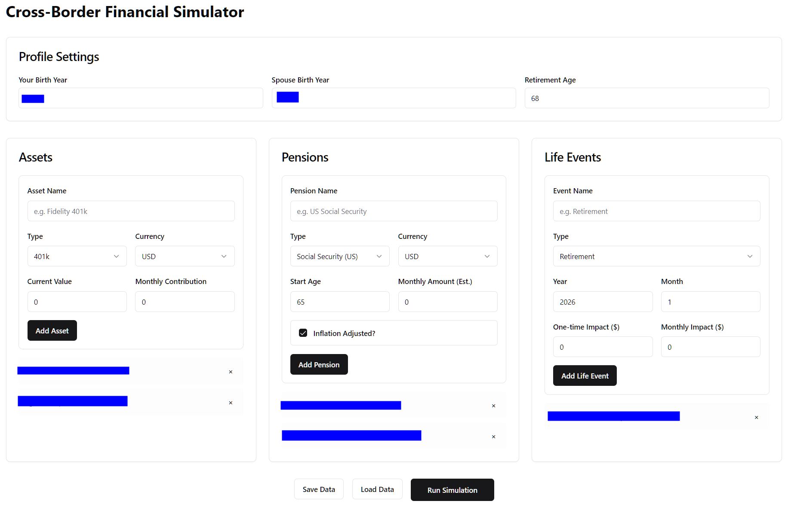
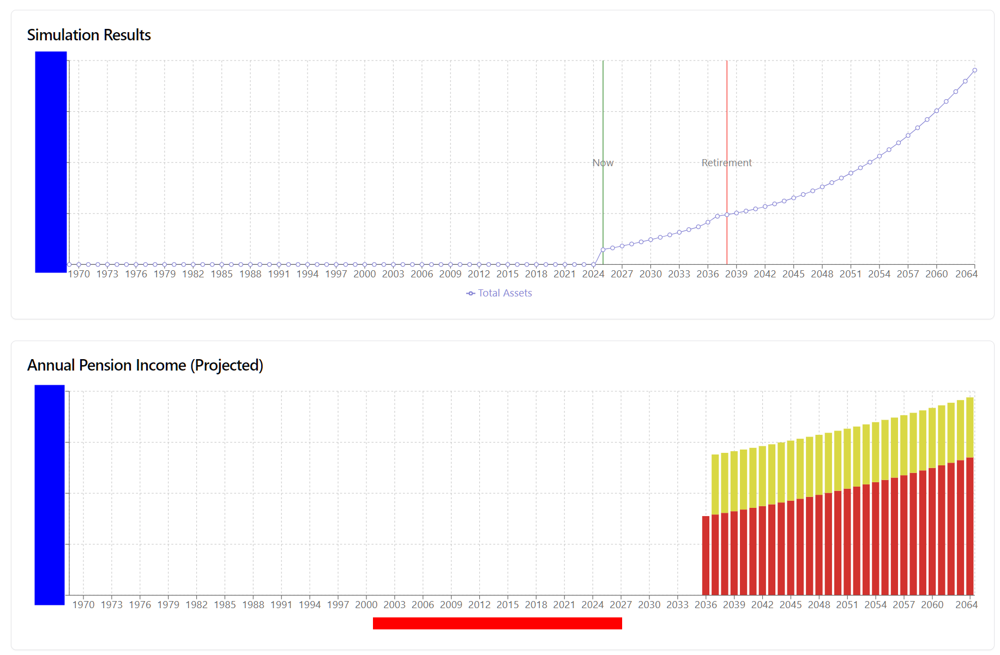

# Cross-Border Financial Simulator

A financial simulation tool designed for US-based Japanese expatriates. It projects asset growth, calculates pension income (Social Security & Japanese Nenkin), and visualizes the impact of life events on long-term financial health.




## Features

*   **Asset Projection**: Simulate growth of 401k, IRA, Brokerage, etc.
*   **Pension Calculation**: Estimate US Social Security and Japanese Pension income with inflation adjustments.
*   **Life Events**: Model retirement, education costs, and relocation impacts.
*   **Multi-Currency**: Handles USD and JPY assets/pensions.
*   **Data Persistence**: Save and load simulation data locally (JSON).
*   **Privacy Focused**: All data is stored locally on your machine.

## Prerequisites

*   **Python 3.9+**
*   **Node.js 18+**
*   **Git**

## Installation & Setup

### 1. Clone the Repository

```bash
git clone <YOUR_REPO_URL>
cd financial-tool
```

### 2. Backend Setup (Python/FastAPI)

Navigate to the backend directory:

```bash
cd backend
```

Create a virtual environment:

```bash
# Windows
python -m venv venv
.\venv\Scripts\activate

# Mac/Linux
python3 -m venv venv
source venv/bin/activate
```

Install dependencies:

```bash
pip install -r requirements.txt
```

Start the backend server:

```bash
uvicorn main:app --reload
```
The backend will start at `http://localhost:8000`.

### 3. Frontend Setup (React/Vite)

Open a new terminal and navigate to the frontend directory:

```bash
cd frontend
```

Install dependencies:

```bash
npm install
```

Start the development server:

```bash
npm run dev
```
The frontend will start at `http://localhost:5173`.

## Usage

1.  Open your browser and go to `http://localhost:5173`.
2.  **Profile**: Enter your birth year in "Profile Settings".
3.  **Assets**: Add your current assets (401k, Cash, etc.).
4.  **Pensions**: Add expected pension income.
5.  **Life Events**: Add future events like Retirement (negative impact for living expenses).
6.  **Run Simulation**: Click the button to see the projection.
7.  **Save/Load**: Use the buttons to save your data locally.

## Project Structure

*   `backend/`: Python FastAPI application (Simulation logic).
*   `frontend/`: React + TypeScript application (UI).
*   `user_data.json`: Local file where your data is saved (created after first save).

## License

[MIT](LICENSE)

